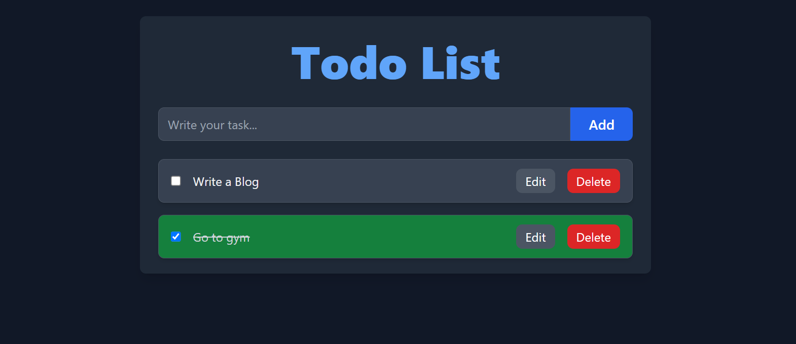

# Todo List Application  

  

A Todo List application built with React and styled using Tailwind CSS.  

## Features  
- **State Management with Context API**: Manage the Todo list state globally across components.  
- **Local Storage Persistence**: Save and load tasks using localStorage for data persistence.  
- **Responsive UI**: Adapts to different screen sizes for an optimal user experience.  
